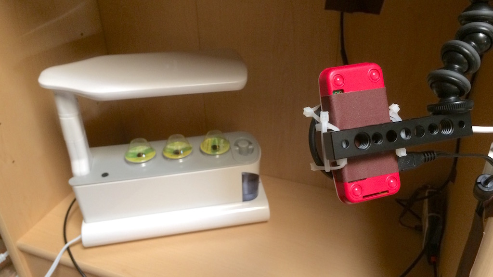
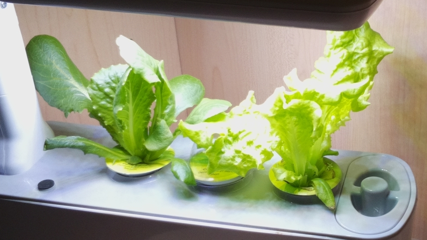
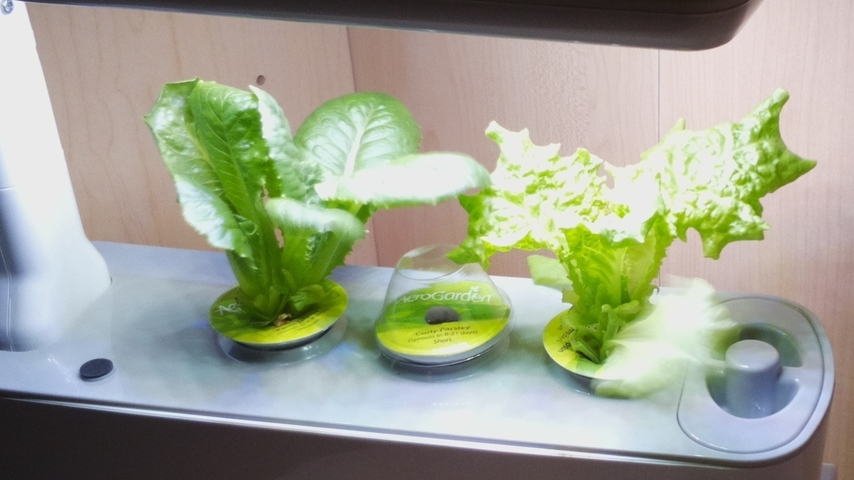

# lettuce-dataset-1

This is the data that I collected using
[simplehydro v0.2.2](https://github.com/wsnook/farm/releases/tag/v0.2.2) through
[farm v0.5.2](https://github.com/wsnook/farm/releases/tag/v0.5.2) to monitor a crop of AeroGarden
salad greens that I grew from 17 April 2017 to 19 May 2017. Along the way, I changed the name of my
monitoring program from simplehydro to farm because I got tired of typing simplehydro.

## Equipment & Supplies

1. Computer and camera: Raspberry Pi Zero W with the Raspberry Pi camera module v2.

3. Camera mount and accessories: JOBY Action Clamp & GorillaPod Arm, SmallRig Camera Cheese Bar,
   generic ND4 & ND8 neutral density filters, and small cable ties.

2. Temperature sensing: Arduino Uno clone with two DS18B20 1-Wire temperature sensors--one suspended
   in the air above the AeroGarden, and one taped to the outside of the tank below water level.

4. AeroGarden Sprout (LED version) with a Salad Greens seed pod kit and external air pump.

5. Enclosure: An old bookshelf.

6. Air circulation: A small AC powered personal fan.

## Procedure

1. I initially set the electronics up according to the simplehydro
   [v0.2.2 setup instructions](https://github.com/wsnook/farm/blob/v0.2.2/README.md). While the
   lettuce was growing, I upgraded the software several times using the deployment script which is
   now at [wsnook/farm/deploy.sh](https://github.com/wsnook/farm/blob/master/deploy.sh).

2. Lights: I used a HydroFarm timer to turn the AeroGarden on from 6am to 8pm every day to give a
   14 hour photoperiod because the Aerogarden's built in 16 hour timer is longer than ideal for
   lettuce. I left the grow lights off for the first day.

3. Air pump: I modified the AeroGarden to disconnect its internal air pump and bring the air hose
   outside of the case. I connected it initially to a Tetra Whisper pump for 10-20 gallon tanks.
   That one was louder than I liked, so I switched to an Active Aqua 3.2 L/min pump with adjustable
   output. The second pump was tolerably quiet, but definitely not silent.

4. Watering and nutrients: I followed AeroGarden's instructions for their hydroponic plant food--add
   4 mL of plant food to 1 tank of water initially, top off the tank to the fill line daily with
   plain water, add another 4 mL of plant food after 2 weeks, then mix a fresh batch of nutrient
   solution at 4 weeks. I used distilled water as recommended by the AeroGarden instruction--they
   say that most tap water is also okay, but don't use well water. To top of the tank, I used a
   500 mL wash bottle of the type sold for use in chemistry labs--it worked great.

   To change the nutrients, I made a siphon from about 3 feet of food grade tubing and two hose
   clamps. I filled the middle of the tube with water, and closed both clamps, put one end of the
   tube in an empty gallon jug on the floor, and put the other end of the tube in the AeroGarden
   tank--lifting the lid minimally to avoid disturbing roots. When I opened both hose clamps--upper
   clamp first--the siphon started and drained the tank in a minute or two.

5. Fan: I used my farm controller's web dashboard to monitor temperatures of the tank and ambient
   air. When the tank temperature was above 24 &deg;C, I manually turned on an air circulation fan
   that I left on until after the lights turned off.

6. Data collection: I used my farm controller software to record temperature logs and time lapse
   images at 20 minute intervals--10, 30, and 50 minutes past each hour. After 32 days, I had about
   770MB of images. So, to make this repository a reasonable size, I've only included images from
   30 minutes past the hour, and only when there was enough light to see the AeroGarden. To further
   reduce the image size, I removed thumbnail previews with
   `exiftool -ifd1:all= -ext jpg .`
   and by cropping them with
   `mogrify -crop 854x480+62+58 *.jpg`
   to show only the portion of the frame where lettuce was growing.

   The sensor log file includes TSV data in two different formats because I added the ability to
   save notes with the farm CLI tool part way through this crop. The first portion of the
   temperature log uses the same DS18B20 sensors--in the same configuration--as what I described at
   [wsnook/radish-dataset-1/README.md](https://github.com/wsnook/radish-dataset-1/blob/master/README.md#procedure).

## Notes

1. I recorded fan off and fan on times for a while, then I got tired of it and just turned the fan
   on and off without taking notes about it. I handled topping off the nutrient tank and harvesting
   leaves the same way.

2. The leaves each weighed less than 1 gram, so it wasn't practical to track how much I harvested
   using AeroGarden's recommended "cut and come again" method--I was only able to get about a leaf
   or two per day. When I ended the experiment, the final harvest was 7 grams.

   This was my final harvest:
   

## License: CC BY-SA 4.0

 This work is licensed under a
<a rel="license" href="http://creativecommons.org/licenses/by-sa/4.0/">Creative
Commons Attribution-ShareAlike 4.0 International License</a>.
